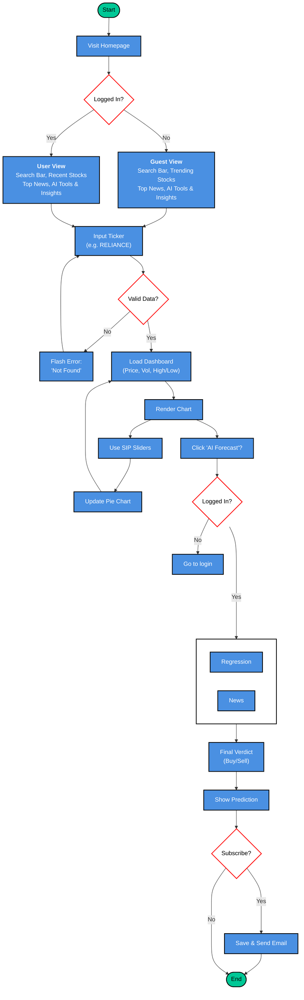

# MarketMind Workflow Diagram

Here is the revised diagram. I've strictly aligned the paths to reflect the exact loops, branches, and specific column layout behaviors present in the actual image (e.g. the update loops, valid-data cycles, and right-column jumping), while injecting the new responsive homepage logic explicitly!

